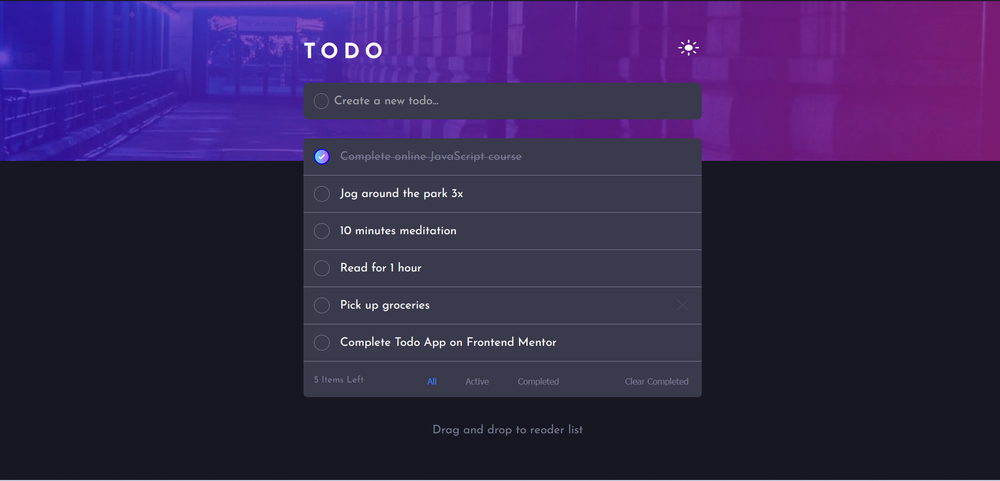
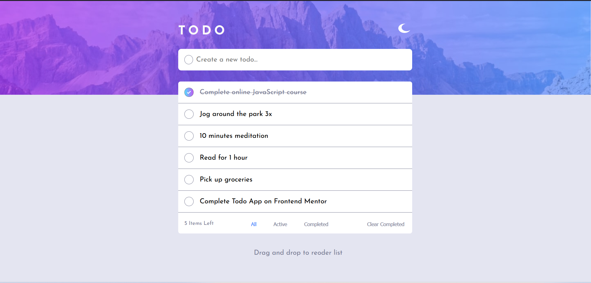
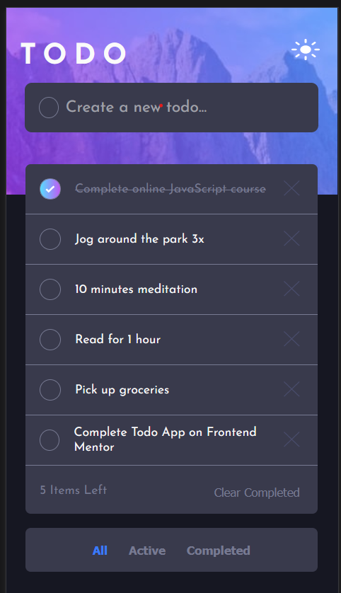
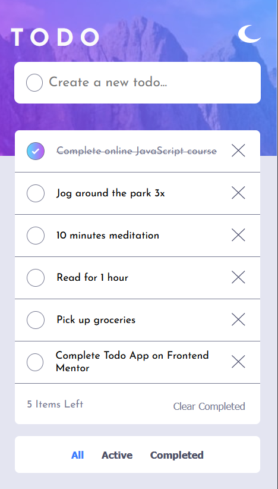

# Frontend Mentor - Todo app solution

This is a solution to the [Todo app challenge on Frontend Mentor](https://www.frontendmentor.io/challenges/todo-app-Su1_KokOW). Frontend Mentor challenges help you improve your coding skills by building realistic projects.

## Table of contents

- [Overview](#overview)
  - [The challenge](#the-challenge)
  - [Screenshot](#screenshot)
  - [Links](#links)
- [My process](#my-process)
  - [Built with](#built-with)
  - [What I learned](#what-i-learned)
  - [Continued development](#continued-development)
  - [Useful resources](#useful-resources)
- [Author](#author)
- [Acknowledgments](#acknowledgments)

## Overview

### The challenge

Users can:

- View the optimal layout for the app depending on their device's screen size
- See hover states for all interactive elements on the page
- Add new todos to the list
- Mark todos as complete
- Delete todos from the list
- Filter by all/active/complete todos
- Clear all completed todos
- Toggle light and dark mode
- Drag and drop to reorder items on the list

### Screenshot






### Links

- Solution URL: [My Solution](https://www.frontendmentor.io/solutions/mobile-first-solution-to-todo-app-using-flexbox-scss-and-localstorage-wsNzofvrw7)
- Live Site URL: [Live Site](https://kaustubhmaladkar.github.io/Todo-App/)

## My process

### Built with

- Semantic HTML5 markup
- Flexbox
- Mobile-first workflow
- JavaScript LocalStorage
- [Sortable JS](https://sortablejs.github.io/Sortable/) - For reordering the list
- [SASS](https://sass-lang.com/) - For styles

### What I learned

```html
<p draggable="true"></p>
```

```css
::placeholder {
  color: $very-light-grey;
}
element {
  background: url("images/icon-check.svg"), linear-gradient(to right, hsl(192, 100%, 67%), hsl(280, 87%, 65%));
}
```

```js
element.classList.replace("class1", "class2");
arr.findIndex();
arr.map();
```

### Continued development

- LocalStorage
- Arrays
- Accessibility

### Useful resources

- Thanks to [dotancohen](https://stackoverflow.com/users/343302/dotancohen) for their answer on [this Stackoverflow question](https://stackoverflow.com/questions/9264835/how-to-align-an-input-tag-to-the-center-without-specifying-the-width)

- Thanks to [Yves Kipondo](https://stackoverflow.com/users/6108283/yves-kipondo) for their answer on [this Stackoverflow question](https://stackoverflow.com/questions/52554613/html-5-drag-and-drop-not-working-on-mobile-screen)

- [This article](https://css-tricks.com/almanac/selectors/p/placeholder/) on css-tricks.com helped me understand how to target the placeholder of my input in order to style it

- Thanks to [danield](https://stackoverflow.com/users/703717/danield) for their answer on [this Stackoverflow question](https://stackoverflow.com/questions/35269947/how-can-i-align-one-item-right-with-flexbox/35270047#35270047)

- Thanks to [Dinesh Kumar](https://stackoverflow.com/users/1782556/dinesh-kumar) for their answer on [this Stackoverflow question](https://stackoverflow.com/questions/16629561/why-is-vertical-align-middle-not-working-on-my-span-or-div)

- Thanks to [TomasCarvalho](https://stackoverflow.com/users/2446264/tomascarvalho) for their answer on [this Stackoverflow question](https://stackoverflow.com/questions/51303211/how-to-add-item-to-local-storage)

- [This article](https://css-tricks.com/working-with-javascript-media-queries/) on css-tricks.com helped me tackle mediaQuries with JavaScript.

- [This article](https://developer.mozilla.org/en-US/docs/Web/API/Window/resize_event[]) on MDN helped me with resize event

- [This article](https://developer.mozilla.org/en-US/docs/Web/JavaScript/Reference/Global_Objects/Array/findIndex) on MDN hel-ped me with the findIndex() function

- [This article](https://graphicscove.com/why-does-localstorage-getitem-log-object-object) on graphicscove.com helped me refresh my memeory of localStorage and debug my code

- Thanks to [Grzegorz](https://stackoverflow.com/users/1430632/grzegorz) for their answer on [this Stackoverflow question](https://stackoverflow.com/questions/34807614/should-i-wait-for-domcontentloaded-event-if-i-place-a-script-tag-at-the-end-0of-a)

## Author

- Instagram - [maladkarkaustubh](https://www.instagram.com/maladkarkaustubh/)
- Frontend Mentor - [KaustubhMaladkar](https://www.frontendmentor.io/profile/KaustubhMaladkar)
- Discord - [KaustubhMaladkar](discordapp.com/879677662795280445)

## Acknowledgments

Thanks to [Quangphan](https://www.frontendmentor.io/profile/quangnphan) for their [solution](https://www.frontendmentor.io/solutions/todo-app-Z3uvRFUqu) of the same challenge which helped me to

- make the "check" buttons
- add the background to the "checked" buttons
